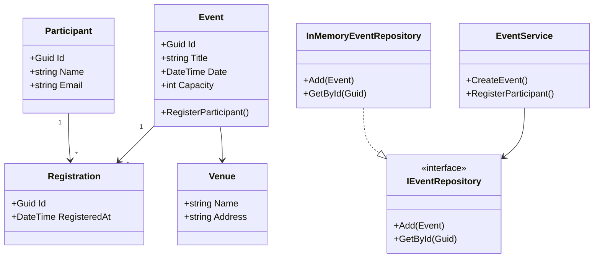

# Class Diagram

```mermaid
classDiagram

class Event {
    +Guid Id
    +string Title
    +DateTime Date
    +int Capacity
    +RegisterParticipant()
}

class Participant {
    +Guid Id
    +string Name
    +string Email
}

class Registration {
    +Guid Id
    +DateTime RegisteredAt
}

class Venue {
    +string Name
    +string Address
}

class EventService {
    +CreateEvent()
    +RegisterParticipant()
}

class IEventRepository {
    <<interface>>
    +Add(Event)
    +GetById(Guid)
}

class InMemoryEventRepository {
    +Add(Event)
    +GetById(Guid)
}

Event "1" --> "*" Registration
Participant "1" --> "*" Registration
Event --> Venue

EventService --> IEventRepository
InMemoryEventRepository ..|> IEventRepository
```
