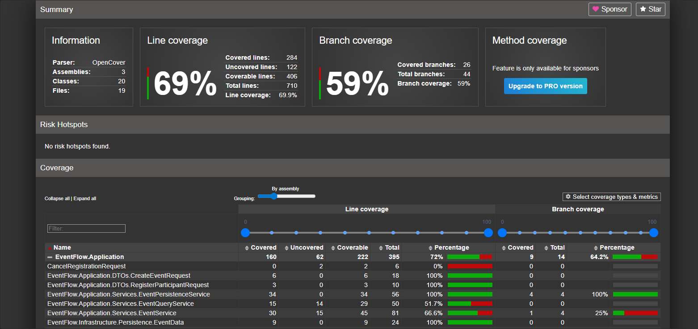

# Test Matrix

| Use Case                            | Unit Tests                                             | Integration Tests                         |
| ----------------------------------- | ------------------------------------------------------ | ----------------------------------------- |
| Створення події                     | CreateEvent_WithValidData                              | CreateAndRegister_ShouldWork              |
| Створення події з некоректною датою | CreateEvent_WithPastDate                               | -                                         |
| Реєстрація учасника                 | RegisterParticipant_WithValidData                      | CreateAndRegister_ShouldWork              |
| Дублювання реєстрації               | RegisterParticipant_WithDuplicateEmail                 | DuplicateRegistration_ShouldFail          |
| Перевищення ліміту учасників        | RegisterParticipant_WhenCapacityExceeded               | FullEvent_ShouldRejectRegistration        |
| Скасування реєстрації               | CancelRegistration_WhenParticipantExists_ShouldSucceed | RegisterAndCancel_ShouldRestoreCapacity   |
| Скасування неіснуючої реєстрації    | CancelRegistration_WhenParticipantNotFound_ShouldFail  | -                                         |
| Активні події                       | GetActiveEvents_ShouldReturnFutureEvents               | -                                         |
| Пошук за категорією                 | GetEventsByCategory_ShouldReturnCorrectEvents          | -                                         |
| Збереження даних                    | SaveAsync_ShouldCreateFile                             | SaveAndLoad_ShouldPreserveEvent           |
| Завантаження даних                  | LoadAsync_WhenFileMissing_ShouldReturnEmptyCollection  | LoadAsync_WhenFileMissing_ShouldNotThrow  |
| Відновлення реєстрацій              | -                                                      | SaveAndReload_ShouldPreserveRegistrations |
| Пошкоджений JSON                    | InvalidJson_ShouldReturnEmptyCollection                | InvalidJson_ShouldReturnEmptyCollection   |

---

## Покриті ризики

### Бізнес-логіка

- дублікати реєстрацій;
- перевищення місткості;
- невалідні дані;
- відсутні об'єкти.

### Persistence

- відсутній файл;
- пошкоджений JSON;
- втрата даних після Save/Load.

### Інтеграція компонентів

- взаємодія Service → Repository;
- взаємодія Persistence → JSON;
- відновлення агрегатів після десеріалізації.

